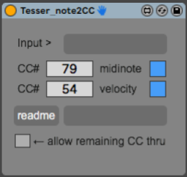

This Patch is part of the [TESSER environment](https://bitbucket.org/AdrianArtacho/tesserakt/src/master/).

# Tesser_note2CC

This device takes in **midinotes** (*notenumber*, *velocity*) and converts is to a CC message.

### Usage

* Quick summary

____

# To-Do

* Cleanup GUI, to make clear how it works

* finish documentation

* An alternative mode could have the *notenumber* set the CC number, 
  and the *notevalue* be the value of the CC message. Or vice versa.
  as

* make sure all object names are ---

* make sure all stored values have `Param mode enable` activated.

* add `clientwindow` button
